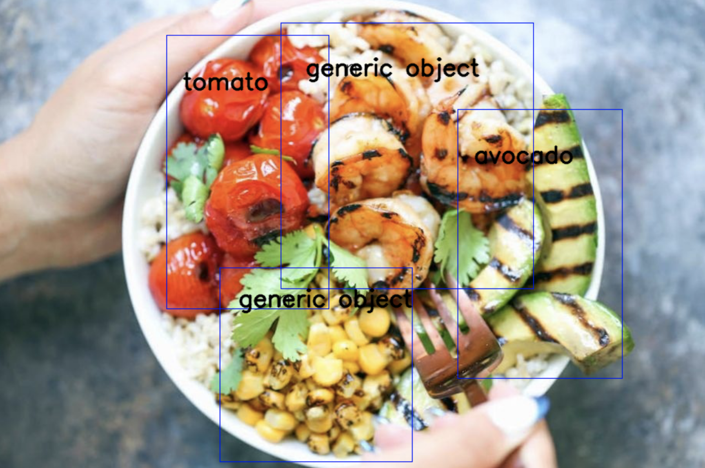

# Warning

This is only an alpha version of the model. Selection of hyperparameters was not performed. Not all ideas have been implemented.
This implementation is not suitable for implementation in other projects.

# CLIPDetection

CLIPDetector is a two neural networks, CLIP and Faster R-CNN, that allow you to detect classes of objects that weren't in the training set. Faster R-CNN generate two types of boxes: simple object boxes and generic object boxes. Simple object boxes are associated with the classes of objects that were in the training set. Generic object boxes are associated with objects that can't be classified. They are classified by CLIP.

## Usage

First you need to run `setup.py` file.

```python
from CLIPDetection.CLIPDetector import CLIPDetector
from CLIPDetection.detectron2.config import get_cfg
```

Then you need to create config, for example:

```python
cfg = get_cfg()
cfg.merge_from_file("detectron2_repo/configs/COCO-Detection/faster_rcnn_R_50_FPN_3x.yaml")
cfg.MODEL.WEIGHTS = "weights/model_final.pth"

cfg.MODEL.ROI_HEADS.SCORE_THRESH_TEST = 0.5
cfg.MODEL.ROI_HEADS.OBJECTNESS_NMS_THRESH_TEST = 0.25
cfg.MODEL.ROI_HEADS.OBJECTNESS_SCORE_THRESH_TEST = 1.0

cfg.INPUT.MIN_SIZE_TEST= 300
cfg.INPUT.MAX_SIZE_TEST = 300
cfg.INPUT.FORMAT = 'BGR'

cfg.MODEL.ROI_HEADS.NAME = 'GenericROIHeads'
cfg.MODEL.ROI_HEADS.NUM_CLASSES = 41

cfg.CLIP_BACKBONE = 'RN50x4'
cfg.DEVICE = 'cuda'
```

The main class for making predictions is `CLIPDetector`. It takes config, classes that were in training set and additional classes that are classified by CLIP. Predictions are made on PIL images.


```python
detector = CLIPDetector(cfg, source_classes, additional_classes)
coords, labels = detector.detect(pil_image)
```

## Example

This prediction was made on CLIPDetector, which was retrained on our dataset. Additional classes here are shrimps and corn.


